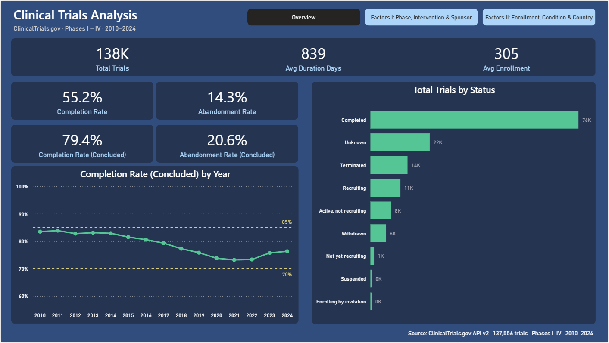
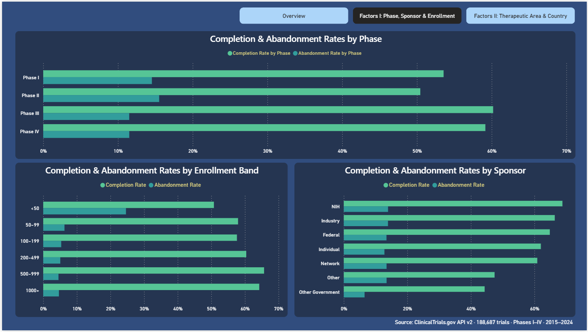
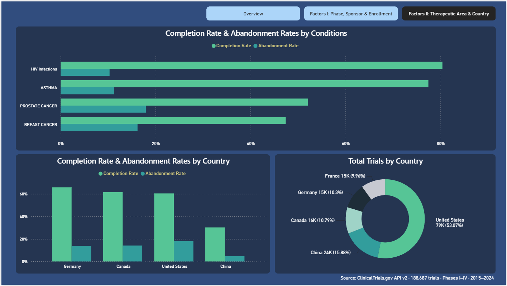

# Clinical Trials Analysis

**What determines whether a clinical trial completes or is abandoned?**

An end-to-end data analytics project exploring completion and abandonment patterns across 137,556 clinical trials registered in ClinicalTrials.gov (Phases I–IV, 2010–2024).

Built as a portfolio project to demonstrate a full analytics pipeline: API ingestion → data warehouse → dimensional modelling → interactive dashboard.

---

## Table of Contents

- [Business Context](#business-context)
- [Data & Methodology](#data--methodology)
- [Technical Architecture](#technical-architecture)
- [Key Findings](#key-findings)
- [Dashboard](#dashboard)
- [Known Limitations & Future Work](#known-limitations--future-work)
- [How to Reproduce](#how-to-reproduce)
- [Repository Structure](#repository-structure)

---

## Business Context

Clinical trial completion is one of the most resource-intensive problems in drug development. A trial that is abandoned after years of execution represents not only wasted investment but a delayed or missed treatment for patients. Understanding which factors — trial phase, intervention type, sponsor type, therapeutic area, enrollment size, and geography — are associated with higher abandonment rates has direct implications for portfolio planning in pharma, biotech, and CROs.

**Central question:**
> Which factors — trial phase, intervention type, sponsor type, therapeutic area, enrollment size, and country — determine whether a clinical trial registered in ClinicalTrials.gov reaches completion or is abandoned/suspended?

**Data source:** [ClinicalTrials.gov API v2](https://clinicaltrials.gov/data-api/api) (public, no authentication required)
**Scope:** Phases I–IV · 2010–2024 · 137,556 trials

---

## Data & Methodology

### Analytical Definitions

Three custom flags were derived from ClinicalTrials.gov's official status vocabulary:

| Flag | Definition | Rationale |
|---|---|---|
| `is_completed` | `overall_status = 'Completed'` | Official ClinicalTrials.gov definition of a trial reaching its planned endpoint |
| `is_abandoned` | `Terminated` OR `Withdrawn` OR `Suspended` | Trials that ended without reaching their planned endpoint — an analytical decision reflecting trials with no planned outcome |
| `is_concluded` | `is_completed OR is_abandoned` | Trials with a definitive outcome, used as the denominator for the temporal analysis |

### Data Quality — Bug Discovery & Correction

During a review of the extraction pipeline, two data quality issues were identified and fixed:

1. **API query precedence bug.** The original extraction filter, `StartDate AND Phase1 OR Phase2 OR Phase3 OR Phase4`, was evaluated by the API as `(StartDate AND Phase1) OR Phase2 OR Phase3 OR Phase4` — meaning trials in Phases II, III, and IV were pulled in with **no date filter applied at all**. This inflated the dataset to 188,687 trials, including tens of thousands outside the intended 2010–2024 window. The fix was a one-character change: `StartDate AND (Phase1 OR Phase2 OR Phase3 OR Phase4)`.

2. **Missing range validation in staging.** The staging model validated date *format* (`YYYY-MM-DD`) but not date *range*, so malformed upstream data could silently pass through. A second barrier was added: an explicit `BETWEEN '2010-01-01' AND '2024-12-31'` check in `stg_clinical_trials`.

After both fixes, re-extraction produced the correct, in-scope dataset: **137,556 trials** (down from 188,687). This is documented here rather than silently corrected because it materially changed one of the analytical findings below (see Finding 2) — a reminder that a plausible-looking result is not the same as a correct one, and that independent tie-out (DuckDB ↔ Power BI ↔ a standalone EDA notebook) is what catches this kind of error.

### Temporal Bias — Maturity Effect

A raw completion rate chart shows a visible dip in the middle of the period. This is **not a real deterioration** — it is a maturity effect: trials registered more recently have not had enough time to complete. They remain in active or recruiting status, pulling down the raw rate artificially.

To correct for this, the temporal analysis uses **Completion Rate (Concluded)** = Completed ÷ (Completed + Abandoned), which removes all still-active trials from the denominator. The corrected rate oscillates between roughly 70% and 85% across the entire period, confirming that the apparent dip is a statistical artefact, not a real signal.

Both metrics are visible in the dashboard: the raw rate (55.2%) as a global KPI reflecting the full dataset as extracted, and the corrected rate (79.4%) for the temporal trend line.

### Enrollment Bands

Enrollment was categorised into six bands to enable comparison across trial sizes:

`<50` · `50–99` · `100–199` · `200–499` · `500–999` · `1,000+`

### Condition Normalization

Free-text condition fields from the API contain orthographic variants of the same underlying condition (e.g. "COVID-19" vs "Covid19"). A dbt seed (`condition_normalization.csv`, 3,771 mappings) maps raw values to a canonical `condition_name_normalized`, implemented as a new intermediate model (`int_condition_normalized`). Both `condition_name_raw` and `condition_name_normalized` are kept in `dim_condition` for traceability. This normalization covers the variants detected by an automated matching pass; full manual review of all ~45,000 unique conditions was out of scope (see Limitations).

### Thresholds for Statistical Representativeness

Rates computed from very small sample sizes are not reliable. The following minimum thresholds were applied:

- Therapeutic areas: ≥ 1,000 trials (excluding non-medical "healthy volunteer" conditions, filtered by text match)
- Country bar chart: ≥ 10,500 trials

---

## Technical Architecture

```
ClinicalTrials.gov API v2
         │
         ▼
  Python (extract_api_data.py)
  ├── Incremental saving with checkpoint/resume (WSL2 stability)
  ├── Date filter: (StartDate) AND (Phase1 OR Phase2 OR Phase3 OR Phase4)
  └── 137,556 records → raw JSON
         │
         ▼
  DuckDB (dwh_dev.duckdb)
  └── raw.raw_clinical_trials (28 columns)
         │
         ▼
  dbt Core 1.11.11 / dbt-duckdb 1.10.1 (14 models · 1 seed · 45/45 tests PASS)
  ├── Staging:      stg_clinical_trials (+ date range validation)
  ├── Intermediate: int_condition_normalized
  ├── Fact:         fct_clinical_trials (137,556 rows)
  ├── Dims:         dim_date · dim_status · dim_phase · dim_sponsor
  │                 dim_condition · dim_country · dim_intervention_type
  └── Bridges:      brg_trial_phase · brg_trial_condition
                     brg_trial_country · brg_trial_intervention
         │
         ▼
  Parquet export (Python/DuckDB → Windows filesystem)
         │
         ▼
  Power BI Desktop
  ├── Semantic model (13 relationships, 12 active + 1 inactive)
  ├── 15 DAX measures
  └── 3-page interactive dashboard

> **EDA:** Before building the dashboard, a full exploratory analysis was conducted in `notebooks/01_exploration_SLA.ipynb`. Every metric is computed independently against DuckDB — not against Power BI — and compared to the dashboard values as a tie-out check, catching discrepancies rather than assuming the dashboard is correct by default.
```

**Stack:**

| Tool | Role |
|---|---|
| Python 3.12 | API ingestion, Parquet export |
| DuckDB | Local data warehouse |
| dbt Core | Transformations, data quality tests, lineage |
| Power BI Desktop | Dashboard and semantic model |
| DBeaver | Independent SQL verification of dashboard numbers |
| Git + GitHub | Version control and public portfolio |

> **Note on Power BI connectivity:** Mart tables are served to Power BI via Parquet export rather than a live DuckDB ODBC connection. The initial approach was a direct ODBC connection — first attempted from within WSL2 (blocked by a path configuration error), then from a copy of the database file on the Windows filesystem (the connection loaded tables but hung before completing). Rather than continue debugging the environment, Parquet export was adopted as a pragmatic working alternative: mart tables are copied from DuckDB to Parquet files, which Power BI reads directly. The DuckDB database remains the source of truth; Parquet is a transport layer for the reporting tier, not a duplicate source of logic.

---

## Key Findings

### Global KPIs

| Metric | Value |
|---|---|
| Total trials | 137,556 |
| Completion Rate | 55.2% |
| Abandonment Rate | 14.3% |
| Completion Rate (Concluded) | 79.4% |
| Abandonment Rate (Concluded) | 20.6% |
| Avg. enrollment | 305 participants |
| Avg. duration (completed trials) | 839 days (~2.3 years) |

---

### Finding 1 — Phase II is the riskiest phase

Phase II has the lowest completion rate (46.8%) and the highest abandonment rate (17.0%) of all phases. Phase I, III, and IV all sit meaningfully higher. This aligns with the known "Phase II valley of death" in drug development: early signals of safety (Phase I) are promising, but efficacy proof is where most programmes fail.

| Phase | Completion Rate | Abandonment Rate |
|---|---|---|
| Phase I | 61.0% | 14.2% |
| Phase II | 46.8% | 17.0% |
| Phase III | 55.6% | 12.6% |
| Phase IV | 56.1% | 12.0% |

---

### Finding 2 — Industry outperforms NIH in completion rate (a finding that reversed after the bug fix)

With the corrected dataset, **Industry-sponsored trials complete at a substantially higher rate (67.5%) than NIH-sponsored trials (52.7%)** — a 15-point gap in the opposite direction from what the contaminated dataset had suggested. This is a useful example of why the bug-fix story above matters: the date-filter bug disproportionately affected which trials were included per sponsor type, and correcting it changed not just the magnitude but the *direction* of this finding.

| Sponsor | Completion Rate | Abandonment Rate |
|---|---|---|
| Industry | 67.5% | 14.6% |
| Individual | 61.7% | 15.0% |
| Federal | 57.1% | 17.3% |
| NIH | 52.7% | 19.5% |
| Network | 49.1% | 13.1% |
| Other | 46.2% | 14.3% |
| Other Government | 43.7% | 5.7% |

A plausible explanation: industry portfolios are managed under stronger commercial and governance pressure to see a trial through, whereas NIH-funded research includes a larger share of exploratory, hypothesis-generating studies that are more readily discontinued when early signals are weak.

---

### Finding 3 — Very small trials have a sharply elevated abandonment risk

The relationship between enrollment size and outcome is not a smooth gradient — it is a cliff. Trials with fewer than 50 participants abandon at **24.5%**, roughly 4–6x the rate of every other enrollment band, which all cluster between 4.1% and 6.1%. Completion rate itself is fairly flat across bands (52.7%–61.6%), so the story here is specifically about abandonment risk concentrated in the smallest trials — consistent with underfunded or underpowered studies being cut short.

| Enrollment Band | Completion Rate | Abandonment Rate |
|---|---|---|
| <50 | 52.7% | 24.5% |
| 50–99 | 58.2% | 6.1% |
| 100–199 | 56.0% | 5.2% |
| 200–499 | 56.6% | 5.0% |
| 500–999 | 61.6% | 4.1% |
| 1,000+ | 58.4% | 4.7% |

---

### Finding 4 — China is a geographic outlier; Germany leads on completion

Among the four largest trial-hosting countries, China has by far the lowest completion rate (33.3%) — yet also the lowest abandonment rate (5.3%). The gap is explained by a large volume of trials sitting in "Unknown" status: neither completed nor abandoned, simply unreported. This is a data completeness issue in ClinicalTrials.gov reporting for Chinese trials, not evidence that trials are failing. Germany leads in completion rate (64.7%) among the major countries, despite having the smallest trial volume of the four.

| Country | Total Trials | Completion Rate | Abandonment Rate |
|---|---|---|---|
| United States | 56,724 (58.1%) | 59.1% | 19.8% |
| China | 19,201 (19.7%) | 33.3% | 5.3% |
| Canada | 10,977 (11.2%) | 58.4% | 15.7% |
| Germany | 10,754 (11.0%) | 64.7% | 15.0% |

---

### Finding 5 — The highest-volume therapeutic areas show moderate, not high, completion

Among conditions with ≥1,000 trials (excluding non-medical "healthy volunteer" studies), the five largest by volume are COVID-19 and four major cancer indications. None of them are high-completion outliers — all sit in a 32%–47% band, meaningfully below the 55.2% dataset-wide average, and abandonment runs high across the board (17.6%–25.5%). This reflects both the complexity and duration typical of large oncology programmes and the disruption COVID-19 caused to trial continuity.

| Condition | Completion Rate | Abandonment Rate |
|---|---|---|
| COVID-19 | 47.0% | 25.5% |
| Prostate Cancer | 44.4% | 19.1% |
| Multiple Myeloma | 40.4% | 21.3% |
| Breast Cancer | 38.6% | 17.6% |
| Non-Small Cell Lung Cancer | 32.4% | 20.1% |

---

### Finding 6 — Intervention type shows the widest completion spread of any factor

Intervention type produces the largest range of any single factor in this analysis: from 28.6% (Radiation) to 64.0% (Behavioral) — a 35-point spread, wider than Phase, Sponsor, or Country. Behavioral and Dietary Supplement interventions complete most reliably; Radiation and Genetic interventions show the highest abandonment. Drug trials, the largest category by far (over 80% of all trials), sit close to the dataset average.

| Intervention Type | Completion Rate | Abandonment Rate |
|---|---|---|
| Behavioral | 64.0% | 9.6% |
| Dietary Supplement | 62.5% | 9.7% |
| Drug | 55.4% | 15.0% |
| Other | 54.6% | 16.0% |
| Biological | 53.7% | 14.9% |
| Device | 52.6% | 14.2% |
| Combination Product | 42.6% | 12.3% |
| Diagnostic Test | 39.5% | 13.7% |
| Procedure | 39.0% | 15.6% |
| Genetic | 33.0% | 18.8% |
| Radiation | 28.6% | 16.5% |

---

## Dashboard

### Overview



The Overview page shows global KPIs, the corrected temporal trend (Completion Rate by Year using the Concluded denominator, with 70% and 85% reference lines), and the distribution of all trials by status.

---

### Factors I: Phase, Intervention & Sponsor



This page decomposes completion and abandonment rates by trial phase, intervention type, and sponsor type — the three factors most tied to how a trial is designed and run. Each chart shows both rates simultaneously for direct comparison.

---

### Factors II: Enrollment, Condition & Country



This page covers trial size (enrollment bands), therapeutic area (filtered to conditions with ≥1,000 trials, excluding healthy-volunteer studies), and geography. The donut chart highlights the geographic concentration of global clinical research: the United States accounts for 58% of all trials in the dataset.

---

## Known Limitations & Future Work

### 1. Condition normalization is not exhaustive

The normalization seed covers ~3,771 raw-to-canonical mappings detected via automated matching, but the full space of ~45,000 unique raw condition strings has not been manually reviewed. Some orthographic or naming variants may still be treated as distinct conditions.

**Proposed solution:** Incremental manual review of the highest-volume unmapped conditions, prioritized by trial count.

### 2. `primary_purpose` field missing (API v2 migration)

The `primary_purpose` field (Treatment / Prevention / Diagnostic / etc.) is 100% null in the extracted data. This field was moved to a different location in ClinicalTrials.gov API v2 after the registry migration. It would be a valuable analytical dimension and is a candidate for a future extraction update.

### 3. "Healthy volunteer" exclusion relies on a text filter, not a structural flag

Conditions containing "healthy" are excluded from the therapeutic area analysis via a text-match filter applied in the Power BI visual, rather than a proper dimensional flag.

**Proposed solution:** Add an `is_medical_condition` boolean column to `int_condition_normalized` in dbt, so the exclusion logic lives in the transformation layer instead of the reporting layer.

### 4. Parquet transport layer instead of a direct ODBC connection

Mart tables are served to Power BI via Parquet export rather than a live DuckDB ODBC connection. This was not the original plan: a direct ODBC connection was attempted first, but failed for environment-specific reasons — a path misconfiguration when connecting from WSL2, and a connection that hung when retried from a Windows-side copy of the file. Parquet export was adopted as a working substitute once ODBC troubleshooting stalled. The correct fix is to resolve the ODBC connection properly. In a production environment, the preferred architecture would be a cloud data warehouse (e.g. BigQuery, Snowflake) with a native Power BI connector and incremental refresh.

---

## How to Reproduce

### Requirements

- Python 3.12+
- dbt-duckdb
- DuckDB

```bash
# Clone the repository
git clone https://github.com/adriansoriacastellano/clinical_trials_analysis.git
cd clinical_trials_analysis

# Create and activate virtual environment
python -m venv .venv
source .venv/bin/activate  # Linux/macOS
# .venv\Scripts\activate   # Windows

# Install dependencies
pip install -r requirements.txt
```

### Step 1 — Extract data from the API

```bash
python src/extract_api_data.py
```

This script connects to the ClinicalTrials.gov API v2 (no authentication required), applies filters for Phases I–IV within a correctly-parenthesized date window `StartDate AND (Phase1 OR Phase2 OR Phase3 OR Phase4)` covering 2010–2024, and writes the results incrementally to `data/dwh_dev.duckdb`. The extraction supports checkpointing: if interrupted, it can be resumed from the last saved page.

Expected output: **137,556 trials** in `raw.raw_clinical_trials`.

### Step 2 — Run dbt transformations

```bash
cd dbt_project
dbt seed
dbt run
dbt test
```

Expected: 14 models built, 1 seed loaded (`condition_normalization`, 3,771 rows), **45/45 tests passing**.

### Step 3 — Export to Parquet and build the dashboard

The Power BI file (`.pbix`) is not included in this repository as it contains derived data. To rebuild the dashboard, first export the mart tables from DuckDB to Parquet:

```python
import duckdb

con = duckdb.connect("data/dwh_dev.duckdb")

tables = [
    "fct_clinical_trials",
    "dim_date", "dim_status", "dim_phase", "dim_sponsor",
    "dim_condition", "dim_country", "dim_intervention_type",
    "brg_trial_phase", "brg_trial_condition",
    "brg_trial_country", "brg_trial_intervention"
]

for table in tables:
    con.execute(f"COPY marts.{table} TO 'exports/{table}.parquet' (FORMAT PARQUET)")

con.close()
```

Then in Power BI Desktop:
1. Get Data → Parquet → load each file from the `exports/` folder
2. Configure relationships as described in `docs/SLA.md`
3. Recreate the DAX measures listed in `docs/SLA.md`

---

## Repository Structure

```
clinical_trials_analysis/
├── dbt_project/
│   ├── models/
│   │   ├── staging/         # stg_clinical_trials (+ date range validation)
│   │   ├── intermediate/    # int_condition_normalized
│   │   └── marts/           # fct + 7 dims + 4 bridges
│   ├── seeds/
│   │   └── condition_normalization.csv  # 3,771 raw→normalized mappings
│   ├── tests/
│   └── dbt_project.yml
├── src/
│   └── extract_api_data.py  # API ingestion script
├── notebooks/
│   └── 01_exploration_SLA.ipynb  # Independent EDA & tie-out validation against DuckDB
├── docs/
│   └── SLA.md                # Business requirements, KPI definitions, analytical questions
├── assets/
│   └── images/                # Dashboard screenshots
├── requirements.txt
├── Makefile
└── README.md
```

---

## Author

**Adrián Soria Castellano**
Data Analytics · Analytics Engineering
[GitHub](https://github.com/adriansoriacastellano)

*Background in Neuroscience (BSc + MSc). Transitioning into Data Analytics and Analytics Engineering. Currently building analytics engineering projects. Open to Data Analyst and Analytics Engineer roles.*
