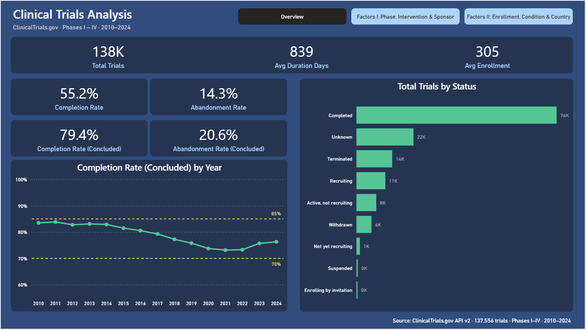
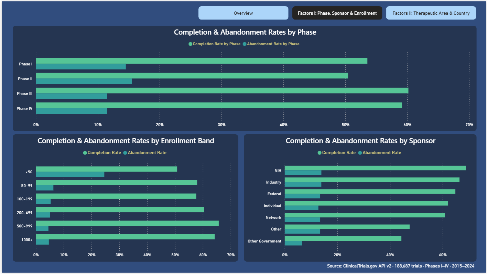
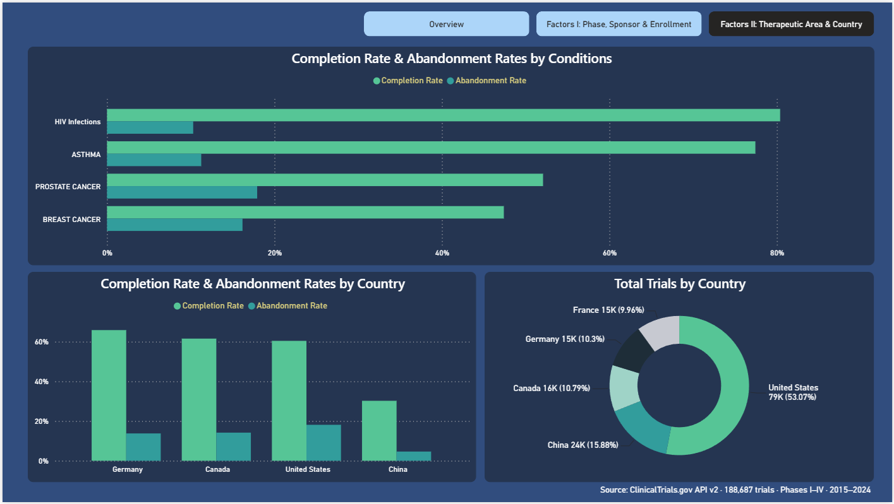

# Clinical Trials Analysis

**What determines whether a clinical trial completes or is abandoned?**

An end-to-end data analytics project exploring completion and abandonment patterns across 137,556 clinical trials registered in ClinicalTrials.gov (Phases I–IV, 2010–2024).

An end-to-end analytics engineering pipeline: API ingestion → dimensional data warehouse → interactive dashboard.

---

## Table of Contents

- [Business Context](#business-context)
- [Data & Methodology](#data--methodology)
- [Technical Architecture](#technical-architecture)
- [dbt Documentation](#dbt-documentation)
- [BigQuery (Optional Cloud Warehouse)](#bigquery-optional-cloud-warehouse)
- [Automated Weekly Extraction](#automated-weekly-extraction)
- [A Live View: Streamlit + BigQuery](#a-live-view-streamlit--bigquery)
- [Key Findings](#key-findings)
- [Dashboard](#dashboard)
- [Known Limitations & Future Work](#known-limitations--future-work)
- [How to Reproduce](#how-to-reproduce)
- [Repository Structure](#repository-structure)

---

## Business Context

Clinical trial completion is one of the most resource-intensive problems in drug development. A trial that is abandoned after years of execution represents not only wasted investment but a delayed or missed treatment for patients. Understanding which factors — trial phase, intervention type, sponsor type, therapeutic area, enrollment size, and geography — are associated with higher abandonment rates has direct implications for portfolio planning in pharma, biotech, and CROs.

**Central question:**
> Which factors — trial phase, intervention type, sponsor type, therapeutic area, enrollment size, and country — determine whether a clinical trial registered in ClinicalTrials.gov reaches completion or is abandoned/suspended?

**Data source:** [ClinicalTrials.gov API v2](https://clinicaltrials.gov/data-api/api) (public, no authentication required)
**Scope:** Phases I–IV · 2010–2024 · 137,556 trials

---

## Data & Methodology

### Analytical Definitions

Three custom flags were derived from ClinicalTrials.gov's official status vocabulary:

| Flag | Definition | Rationale |
|---|---|---|
| `is_completed` | `overall_status = 'Completed'` | Official ClinicalTrials.gov definition of a trial reaching its planned endpoint |
| `is_abandoned` | `Terminated` OR `Withdrawn` OR `Suspended` | Trials that ended without reaching their planned endpoint — an analytical decision reflecting trials with no planned outcome |
| `is_concluded` | `is_completed OR is_abandoned` | Trials with a definitive outcome, used as the denominator for the temporal analysis |

### Data Quality — Bug Discovery & Correction

During a review of the extraction pipeline, two data quality issues were identified and fixed:

1. **API query precedence bug.** The original extraction filter, `StartDate AND Phase1 OR Phase2 OR Phase3 OR Phase4`, was evaluated by the API as `(StartDate AND Phase1) OR Phase2 OR Phase3 OR Phase4` — meaning trials in Phases II, III, and IV were pulled in with **no date filter applied at all**. This inflated the dataset to 188,687 trials, including tens of thousands outside the intended 2010–2024 window. The fix was a one-character change: `StartDate AND (Phase1 OR Phase2 OR Phase3 OR Phase4)`.

2. **Missing range validation in staging.** The staging model validated date *format* (`YYYY-MM-DD`) but not date *range*, so malformed upstream data could silently pass through. A second barrier was added: an explicit `BETWEEN '2010-01-01' AND '2024-12-31'` check in `stg_clinical_trials`.

After both fixes, re-extraction produced the correct, in-scope dataset: **137,556 trials** (down from 188,687). This is documented here rather than silently corrected because it materially changed one of the analytical findings below (see Finding 2) — a reminder that a plausible-looking result is not the same as a correct one, and that independent tie-out (DuckDB ↔ Power BI ↔ a standalone EDA notebook) is what catches this kind of error.

### Temporal Bias — Maturity Effect

A raw completion rate chart shows a visible dip in the middle of the period. This is **not a real deterioration** — it is a maturity effect: trials registered more recently have not had enough time to complete. They remain in active or recruiting status, pulling down the raw rate artificially.

To correct for this, the temporal analysis uses **Completion Rate (Concluded)** = Completed ÷ (Completed + Abandoned), which removes all still-active trials from the denominator. The corrected rate oscillates between roughly 70% and 85% across the entire period, confirming that the apparent dip is a statistical artefact, not a real signal.

Both metrics are visible in the dashboard: the raw rate (55.2%) as a global KPI reflecting the full dataset as extracted, and the corrected rate (79.4%) for the temporal trend line.

### Enrollment Bands

Enrollment was categorized into six bands to enable comparison across trial sizes:

`<50` · `50–99` · `100–199` · `200–499` · `500–999` · `1,000+`

### Condition Normalization

Free-text condition fields from the API contain orthographic variants of the same underlying condition (e.g. "COVID-19" vs "Covid19"). A dbt seed (`condition_normalization.csv`, 3,771 mappings) maps raw values to a canonical `condition_name_normalized`, implemented as a new intermediate model (`int_condition_normalized`). Both `condition_name_raw` and `condition_name_normalized` are kept in `dim_condition` for traceability. This normalization covers the variants detected by an automated matching pass; full manual review of all ~45,000 unique conditions was out of scope (see [Known Limitations](#known-limitations--future-work)).

### Thresholds for Statistical Representativeness

Rates computed from very small sample sizes are not reliable. The following minimum thresholds were applied:

- Therapeutic areas: ≥ 1,000 trials (excluding non-medical "healthy volunteer" conditions, filtered by text match)
- Country bar chart: ≥ 10,500 trials

---

## Technical Architecture

```
ClinicalTrials.gov API v2
         │
         ▼
  Python (extract_api_data.py)
  ├── Incremental saving with checkpoint/resume (WSL2 stability)
  ├── Date filter: (StartDate) AND (Phase1 OR Phase2 OR Phase3 OR Phase4)
  └── 137,556 records → raw JSON
         │
         ▼
  DuckDB (dwh_dev.duckdb) — default, local, zero-setup
  └── raw.raw_clinical_trials (28 columns)
  (optional: same raw data also loadable into BigQuery — see below)
         │
         ▼
  dbt Core 1.11.11 — dbt-duckdb 1.10.1 or dbt-bigquery 1.12.0
  (14 models · 1 seed · 48/48 tests PASS, identical on both targets)
  ├── Staging:      stg_clinical_trials (+ date range validation)
  ├── Intermediate: int_condition_normalized
  ├── Fact:         fct_clinical_trials (137,556 rows)
  ├── Dims:         dim_date · dim_status · dim_phase · dim_sponsor
  │                 dim_condition · dim_country · dim_intervention_type
  └── Bridges:      brg_trial_phase · brg_trial_condition
                     brg_trial_country · brg_trial_intervention
         │
         ▼ (both dashboards read the bigquery target's marts — see Automated Weekly Extraction)
  ├── Power BI Desktop — live Google BigQuery connector (Import mode)
  │   ├── Semantic model (13 relationships, 12 active + 1 inactive)
  │   ├── 15 DAX measures
  │   └── 3-page interactive dashboard
  └── Streamlit + Plotly — public, live, deployed on Streamlit Community Cloud
      └── same 3 pages, no manual refresh needed (see A Live View below)

> **EDA:** Before building the dashboard, a full exploratory analysis was conducted in `notebooks/01_exploration_SLA.ipynb`. Every metric is computed independently against DuckDB — not against Power BI — and compared to the dashboard values as a tie-out check, catching discrepancies rather than assuming the dashboard is correct by default.
```

**Stack:**

| Tool | Role |
|---|---|
| Python 3.12 | API ingestion, statistical validation (SciPy), BigQuery loading |
| DuckDB | Local data warehouse (default) |
| dbt Core | Transformations, data quality tests, lineage |
| Power BI Desktop | Dashboard and semantic model, connected live to BigQuery |
| Streamlit + Plotly | Public live dashboard, same data, no Desktop install needed |
| DBeaver | Independent SQL verification of dashboard numbers |
| BigQuery | Cloud warehouse target — same 14 models, no code fork; what both dashboards read from |
| Git + GitHub | Version control and public portfolio |

> **Note on Power BI connectivity:** Power BI connects live to BigQuery via the native Google BigQuery connector (Import mode) — no export step, no ODBC driver. This wasn't the first approach: a direct DuckDB ODBC connection was attempted first (blocked by a path issue when connecting from WSL2, then a hang even after copying the database file to the Windows filesystem to rule that out), and a Parquet export was used as a working interim step while BigQuery didn't exist yet. Once the `bigquery` dbt target was added and verified row-for-row identical to DuckDB (see [BigQuery (Optional Cloud Warehouse)](#bigquery-optional-cloud-warehouse)), the dashboard's source was switched to it directly and the Parquet step was removed.

---

## dbt Documentation

The full dbt project documentation — model lineage graph (DAG), column-level descriptions, test coverage, and source freshness — is published at:

**[adriansoriacastellano.github.io/clinical_trials_analysis](https://adriansoriacastellano.github.io/clinical_trials_analysis/)**

It's generated with `dbt docs generate` and served as a static site from the `gh-pages` branch, kept separate from `main` so regenerating it doesn't add noise to the project's real history. It isn't rebuilt automatically yet (no CI is configured — see [Known Limitations](#known-limitations--future-work)), so it reflects the state of the dbt project as of the last manual publish. To refresh it:

```bash
cd dbt_project
dbt docs generate -t dev
# then copy target/index.html, target/manifest.json and target/catalog.json
# to the root of the gh-pages branch and push
```

---

## BigQuery (Optional Cloud Warehouse)

By default this project runs entirely locally against DuckDB (the `dev` target) — no cloud account needed to clone and run it. A second dbt target, `bigquery`, runs the **same 14 models** against a real cloud data warehouse instead, to show the local-to-cloud path without giving up the zero-cost, zero-setup default. At the time this target was added and verified, `dbt run`/`dbt test` against `bigquery` produced identical results to `dev`: 48/48 tests passing, and every mart table matching row-for-row — confirming the SQL itself is portable, not just that it runs. Since [Automated Weekly Extraction](#automated-weekly-extraction) started refreshing BigQuery on its own schedule, the two targets' *data* will drift apart over time even though the *models* stay identical; see the snapshot note in [Key Findings](#key-findings).

### 1. Create a GCP project and enable BigQuery
1. Create a project at [console.cloud.google.com](https://console.cloud.google.com/).
2. Enable billing (a card is required, but BigQuery's **Always Free tier** — 1 TB of queries/month + 10 GB storage — comfortably covers this project's ~140K rows; expect $0). Set a small budget alert as a safety net.
3. Search **"BigQuery API"** in the console and enable it for the project.

### 2. Create a service account and key
1. **IAM & Admin → Service Accounts → Create Service Account.**
2. Grant it two roles: **BigQuery Data Editor** and **BigQuery Job User**.
3. Open the service account → **Keys → Add Key → Create new key → JSON**. This downloads a credentials file.

**Never commit this file or place it inside the repo.** Store it somewhere outside the project folder (e.g. `~/.gcp/`).

### 3. Set environment variables

```bash
export BIGQUERY_PROJECT="your-gcp-project-id"
export BIGQUERY_KEYFILE="/absolute/path/to/service-account-key.json"
export BIGQUERY_DATASET="main"   # optional — defaults to "main" if unset
```

### 4. Add a `bigquery` target to your local `~/.dbt/profiles.yml`

`profiles.yml` is never committed to the repo (it lives outside it and holds credential paths), so this is a one-time local addition alongside the existing `dev`/`prod` DuckDB targets:

```yaml
dbt_project:
  target: dev   # keep DuckDB as the default; opt into BigQuery explicitly with -t bigquery
  outputs:
    dev:
      type: duckdb
      path: "/absolute/path/to/clinical_trials_analysis/data/dwh_dev.duckdb"
    bigquery:
      type: bigquery
      method: service-account
      project: "{{ env_var('BIGQUERY_PROJECT') }}"
      dataset: "{{ env_var('BIGQUERY_DATASET', 'main') }}"
      keyfile: "{{ env_var('BIGQUERY_KEYFILE') }}"
      threads: 4
      location: US
```

### 5. Load the raw data into BigQuery

`src/extract_api_data.py` is unchanged — it still writes locally (CSV + the DuckDB dev warehouse) regardless of which dbt target you use. A separate script loads the resulting CSV into BigQuery's `raw` dataset (created automatically if it doesn't exist):

```bash
python src/load_raw_to_bigquery.py
```

### 6. Run dbt against BigQuery

```bash
cd dbt_project
dbt seed -t bigquery
dbt run -t bigquery
dbt test -t bigquery
```

### How the models stay portable

About a dozen DuckDB-specific SQL constructs don't exist in BigQuery's dialect — JSON array unnesting, pipe-delimited string splitting, the `dim_date` date spine (including DuckDB and BigQuery numbering weekdays differently — both are normalized to the same 0=Sunday convention), `TRY_CAST` vs. `SAFE_CAST`, and date subtraction vs. `DATE_DIFF`. Rather than fork the project into two sets of models, each affected model branches on `{{ target.type }}` and contains both dialects side by side in the same file — one dbt project, two warehouses, nothing to keep in sync by hand.

---

## Automated Weekly Extraction

A GitHub Actions workflow ([`.github/workflows/scheduled_extraction.yml`](.github/workflows/scheduled_extraction.yml)) runs the full pipeline against BigQuery automatically every Monday at 03:00 UTC, and can also be triggered manually from the Actions tab (`workflow_dispatch`, with an optional "force full extraction" input).

Each run:

1. **Restores the previous run's extraction state.** `data/` is gitignored, so it wouldn't otherwise survive between separate workflow runs — an [`actions/cache`](https://github.com/actions/cache) entry stands in for it, holding the merged raw CSV, the pagination checkpoint, and the `LastUpdatePostDate` cutoff saved by the previous run.
2. **Runs `src/extract_api_data.py --skip-duckdb`.** With a restored cutoff, this is an **incremental** extraction: it queries the API for studies with `LastUpdatePostDate` on or after that date only, and upserts the results into the existing CSV by `nct_id` (new studies appended, previously-seen ones replaced with their updated version). With no restored state — first run, a cache eviction, or `--full` / the workflow's `full: true` input — it falls back to the original from-scratch **full** extraction. `--skip-duckdb` just skips rebuilding a local DuckDB file on the runner — nothing in this workflow reads it, since the dbt step below targets `bigquery` only; running locally (no flag) still builds it, same as always.
3. **Loads the merged CSV into BigQuery** (`src/load_raw_to_bigquery.py`) — still a full-refresh (`WRITE_TRUNCATE`) load, which is cheap enough at ~140K rows that making the BigQuery load itself incremental isn't worth the complexity yet.
4. **Runs `dbt build -t bigquery`** — seeds, models, and tests in one DAG-ordered command, against a `profiles.yml` checked into [`.github/dbt/`](.github/dbt/profiles.yml) for CI use only (distinct from the local, credential-holding `~/.dbt/profiles.yml`).
5. **Saves the new extraction state** back to the cache for next week's run.

**Required repository configuration** (Settings → Secrets and variables → Actions):

| Name | Kind | Value |
|---|---|---|
| `GCP_SA_KEY` | Secret | Full contents of the service account JSON key (see [step 2 above](#2-create-a-service-account-and-key)) |
| `BIGQUERY_PROJECT` | Secret | Your GCP project ID |
| `BIGQUERY_DATASET` | Variable (optional) | Defaults to `main` if unset |

**Error handling:** each API page request retries up to 3 times with backoff before giving up. Both scripts log to stdout with timestamps and wrap their entry point in a try/except that logs the full traceback and exits non-zero on any failure, so a broken run shows as a red ✗ in the Actions tab with the actual error visible in the failed step's log.

**A known tradeoff:** the incremental cutoff lives in a GitHub Actions cache entry rather than a database or a file committed back to `main`, specifically so this workflow never needs write access to `main`. Caches can be evicted (7 days unused, or under storage pressure against the repo's 10 GB cache limit); if that happens, the next run silently falls back to a full extraction instead of failing — slower, but not incorrect, since the upsert-by-`nct_id` merge is idempotent either way.

---

## A Live View: Streamlit + BigQuery

**[Live app →](STREAMLIT_APP_URL_PLACEHOLDER)**

**Why this exists:** the Power BI dashboard in this README is screenshots — static PNGs, not something a visitor can click. This app is where the project is actually interactive: a [Streamlit](https://streamlit.io/) app ([`streamlit_app/`](streamlit_app/)) covering the same ground as the 3 Power BI pages (Overview, Factors I, Factors II) plus a 4th with no static equivalent, reading live from BigQuery instead of a Parquet export.

- **Live sidebar filters** (year range, country, phase, sponsor class) apply across all 4 pages as a real SQL `WHERE` on every query — not a client-side re-slice of a table fetched once. Pick "Phase III, Industry, 2015–2020" and every chart on every page reflects it.
- **Cross-Factor Explorer** (4th page): pick any two factors and see completion rate across their intersection as a live heatmap — a view that literally cannot exist as a static screenshot, since it's one of dozens of possible combinations computed on demand.
- Always querying whatever [Automated Weekly Extraction](#automated-weekly-extraction) most recently landed in BigQuery — Power BI needs a manual click and a Desktop install to check for new data (see [Known Limitations #6](#6-the-dashboards-data-refresh-is-manual-not-scheduled)); this is a public link, always current.

**Why a second dashboard instead of just fixing Power BI's refresh:** the `.pbix` isn't in this repo (see [Known Limitations #7](#7-the-power-bi-semantic-model-relationships-dax-measures-isnt-checked-into-the-repo)) and Power BI Service scheduled refresh needs a Pro/PPU license this project doesn't have — both are real constraints, not solved by this app. What Streamlit *does* solve is having something publicly clickable and interactive at all: Power BI Desktop's file isn't shareable as a link the way this is, and its screenshots can't respond to a filter.

**Stack:** [Plotly](https://plotly.com/python/) for charts (the same navy/mint pair as Power BI, validated with the [dataviz-skill](streamlit_app/theme.py) color checks for contrast and colorblind-safe separation), a dedicated `google-cloud-bigquery` client with `st.cache_data`/`st.cache_resource` (queries only re-run once an hour per distinct filter combination, not on every page view), each page's independent queries fired concurrently rather than one at a time (a cold page load went from ~9s to ~4s this way), and a deliberately minimal [`streamlit_app/requirements.txt`](streamlit_app/requirements.txt) separate from the root one (no dbt, no Jupyter — faster Streamlit Cloud builds).

**Deployed on [Streamlit Community Cloud](https://streamlit.io/cloud)** (free tier) — see [`streamlit_app/README.md`](streamlit_app/README.md) for local setup and secrets configuration.

---

## Key Findings

Each finding below is backed by a chi-square test of independence (categorical factor vs. completion/abandonment) and, for its headline comparison, a two-proportion z-test with a 95% confidence interval — both computed independently in [`notebooks/01_exploration_SLA.ipynb`, Section 8](notebooks/01_exploration_SLA.ipynb). With 137,556 trials, p-values are almost always extremely small regardless of how much a factor actually matters in practice, so the notebook also reports effect sizes (Cramér's V) — treat those, not the p-values alone, as the signal of practical importance.

> **Data snapshot:** every figure below comes from a single extraction completed on **2026-06-30** (137,556 trials) — the same dataset behind the statistical validation notebook and the dashboard screenshots, all internally consistent with each other. BigQuery has since moved past this snapshot on its own weekly schedule (see [Automated Weekly Extraction](#automated-weekly-extraction)) and will show slightly different totals if you query it directly; the local DuckDB warehouse still matches every number below exactly, since nothing refreshes it automatically.

### Global KPIs

| Metric | Value |
|---|---|
| Total trials | 137,556 |
| Completion Rate | 55.2% |
| Abandonment Rate | 14.3% |
| Completion Rate (Concluded) | 79.4% |
| Abandonment Rate (Concluded) | 20.6% |
| Avg. enrollment | 305 participants |
| Avg. duration (completed trials) | 839 days (~2.3 years) |

---

### Finding 1 — Phase II is the riskiest phase

Phase II has the lowest completion rate (46.8%) and the highest abandonment rate (17.0%) of all phases — the gap vs. Phase I (61.0% completion) is highly significant (p<0.001). Phase I, III, and IV all sit meaningfully higher. This aligns with the known "Phase II valley of death" in drug development: early signals of safety (Phase I) are promising, but efficacy proof is where most programs fail.

| Phase | Completion Rate | Abandonment Rate |
|---|---|---|
| Phase I | 61.0% | 14.2% |
| Phase II | 46.8% | 17.0% |
| Phase III | 55.6% | 12.6% |
| Phase IV | 56.1% | 12.0% |

---

### Finding 2 — Industry outperforms NIH in completion rate (a finding that reversed after the bug fix)

With the corrected dataset, **Industry-sponsored trials complete at a substantially higher rate (67.5% vs. 52.7% for NIH, p<0.001)** — a 15-point gap in the opposite direction from what the contaminated dataset had suggested. This is a useful example of why the bug-fix story above matters: the date-filter bug disproportionately affected which trials were included per sponsor type, and correcting it changed not just the magnitude but the *direction* of this finding.

| Sponsor | Completion Rate | Abandonment Rate |
|---|---|---|
| Industry | 67.5% | 14.6% |
| Individual | 61.7% | 15.0% |
| Federal | 57.1% | 17.3% |
| NIH | 52.7% | 19.5% |
| Network | 49.1% | 13.1% |
| Other | 46.2% | 14.3% |
| Other Government | 43.7% | 5.7% |

A plausible explanation: industry portfolios are managed under stronger commercial and governance pressure to see a trial through, whereas NIH-funded research includes a larger share of exploratory, hypothesis-generating studies that are more readily discontinued when early signals are weak.

---

### Finding 3 — Very small trials have a sharply elevated abandonment risk

The relationship between enrollment size and outcome is not a smooth gradient — it is a cliff. Trials with fewer than 50 participants abandon at **24.5%** (vs. 6.1% in the next band, p<0.001), roughly 4–6x the rate of every other enrollment band, which all cluster between 4.1% and 6.1%. Completion rate itself is fairly flat across bands (52.7%–61.6%), so the story here is specifically about abandonment risk concentrated in the smallest trials — consistent with underfunded or underpowered studies being cut short.

| Enrollment Band | Completion Rate | Abandonment Rate |
|---|---|---|
| <50 | 52.7% | 24.5% |
| 50–99 | 58.2% | 6.1% |
| 100–199 | 56.0% | 5.2% |
| 200–499 | 56.6% | 5.0% |
| 500–999 | 61.6% | 4.1% |
| 1,000+ | 58.4% | 4.7% |

---

### Finding 4 — China is a geographic outlier; Germany leads on completion

Among the four largest trial-hosting countries, China has by far the lowest completion rate (33.3%) — yet also the lowest abandonment rate (5.3%). Country is significantly associated with outcome overall (χ² test across the four countries, p<0.001). The China gap is explained by a large volume of trials sitting in "Unknown" status: neither completed nor abandoned, simply unreported — a data completeness issue in ClinicalTrials.gov reporting for Chinese trials, not evidence that trials are failing, and confounded enough that it isn't used for a direct proportion test below. Germany leads in completion rate (64.7% vs. 59.1% for the United States, p<0.001) among the major countries, despite having the smallest trial volume of the four.

| Country | Total Trials | Completion Rate | Abandonment Rate |
|---|---|---|---|
| United States | 56,724 (58.1%) | 59.1% | 19.8% |
| China | 19,201 (19.7%) | 33.3% | 5.3% |
| Canada | 10,977 (11.2%) | 58.4% | 15.7% |
| Germany | 10,754 (11.0%) | 64.7% | 15.0% |

---

### Finding 5 — The highest-volume therapeutic areas show moderate, not high, completion

Among conditions with ≥1,000 trials (excluding non-medical "healthy volunteer" studies), the five largest by volume are COVID-19 and four major cancer indications. None of them are high-completion outliers — all sit in a 32%–47% band, meaningfully below the 55.2% dataset-wide average, and abandonment runs high across the board (17.6%–25.5%). The pattern is statistically significant (χ² test across the five conditions, p<0.001), though it's the weakest association of any factor tested (Cramér's V=0.097); the extremes within this band — COVID-19 vs. Non-Small Cell Lung Cancer — differ by 14.6 points (p<0.001). This reflects both the complexity and duration typical of large oncology programs and the disruption COVID-19 caused to trial continuity.

| Condition | Completion Rate | Abandonment Rate |
|---|---|---|
| COVID-19 | 47.0% | 25.5% |
| Prostate Cancer | 44.4% | 19.1% |
| Multiple Myeloma | 40.4% | 21.3% |
| Breast Cancer | 38.6% | 17.6% |
| Non-Small Cell Lung Cancer | 32.4% | 20.1% |

---

### Finding 6 — Intervention type shows the widest completion spread of any factor

Intervention type produces the largest range of any single factor in this analysis: from 28.6% (Radiation) to 64.0% (Behavioral) — a 35-point spread (p<0.001), wider than Phase, Sponsor, or Country. Behavioral and Dietary Supplement interventions complete most reliably; Radiation and Genetic interventions show the highest abandonment. Drug trials, the largest category by far (over 80% of all trials), sit close to the dataset average.

**A nuance the raw spread hides:** despite having the widest range between its two extreme categories, Intervention Type's *overall* association with outcome (Cramér's V=0.112) is more modest than Sponsor's (V=0.210) or Country's (V=0.214) — because the vast majority of trials sit in one category (Drug) close to the dataset average, which dilutes the aggregate association even though the extremes are the furthest apart of any factor. See the [statistical validation notebook](notebooks/01_exploration_SLA.ipynb) for the full effect-size comparison across all six factors.

| Intervention Type | Completion Rate | Abandonment Rate |
|---|---|---|
| Behavioral | 64.0% | 9.6% |
| Dietary Supplement | 62.5% | 9.7% |
| Drug | 55.4% | 15.0% |
| Other | 54.6% | 16.0% |
| Biological | 53.7% | 14.9% |
| Device | 52.6% | 14.2% |
| Combination Product | 42.6% | 12.3% |
| Diagnostic Test | 39.5% | 13.7% |
| Procedure | 39.0% | 15.6% |
| Genetic | 33.0% | 18.8% |
| Radiation | 28.6% | 16.5% |

---

## Dashboard

### Overview



The Overview page shows global KPIs, the corrected temporal trend (Completion Rate by Year using the Concluded denominator, with 70% and 85% reference lines), and the distribution of all trials by status.

---

### Factors I: Phase, Intervention & Sponsor



This page decomposes completion and abandonment rates by trial phase, intervention type, and sponsor type — the three factors most tied to how a trial is designed and run. Each chart shows both rates simultaneously for direct comparison.

---

### Factors II: Enrollment, Condition & Country



This page covers trial size (enrollment bands), therapeutic area (filtered to conditions with ≥1,000 trials, excluding healthy-volunteer studies), and geography. The donut chart highlights the geographic concentration of global clinical research: the United States accounts for 58% of all trials in the dataset.

---

## Known Limitations & Future Work

### 1. Condition normalization is not exhaustive

The normalization seed covers ~3,771 raw-to-canonical mappings detected via automated matching, but the full space of ~45,000 unique raw condition strings has not been manually reviewed. Some orthographic or naming variants may still be treated as distinct conditions.

**Proposed solution:** Incremental manual review of the highest-volume unmapped conditions, prioritized by trial count.

### 2. `primary_purpose` field missing (API v2 migration)

The `primary_purpose` field (Treatment / Prevention / Diagnostic / etc.) is 100% null in the extracted data. This field was moved to a different location in ClinicalTrials.gov API v2 after the registry migration. It would be a valuable analytical dimension and is a candidate for a future extraction update.

### 3. "Healthy volunteer" exclusion relies on a text filter, not a structural flag

Conditions containing "healthy" are excluded from the therapeutic area analysis via a text-match filter applied in the Power BI visual, rather than a proper dimensional flag.

**Proposed solution:** Add an `is_medical_condition` boolean column to `int_condition_normalized` in dbt, so the exclusion logic lives in the transformation layer instead of the reporting layer.

### 4. dbt docs site is published manually, not on every change

The [dbt documentation site](#dbt-documentation) is regenerated and pushed to `gh-pages` by hand, so it can drift out of sync with `main` between publishes. No CI is configured yet.

**Proposed solution:** a GitHub Action that runs `dbt docs generate` and publishes to `gh-pages` on every push to `main`.

### 5. The BigQuery load is full-refresh, and the incremental cutoff is day-grained

[Automated Weekly Extraction](#automated-weekly-extraction) covers the extraction itself incrementally, but `src/load_raw_to_bigquery.py` still does a full-refresh load (`WRITE_TRUNCATE`) of the merged CSV rather than loading only the changed rows — acceptable at ~140K rows, but every run re-uploads the entire table. Separately, the extraction's `LastUpdatePostDate` filter is only as precise as the day the API reports it at, so a study edited on the same calendar day as a run could in principle be picked up a day later than expected, or occasionally refetched twice at a day boundary — harmless given the upsert-by-`nct_id` merge, but not instantaneous.

### 6. The dashboard's data refresh is manual, not scheduled

Power BI now connects live to BigQuery (see [Technical Architecture](#technical-architecture)), but Power BI Desktop only pulls new data when someone clicks Refresh — it never refreshes unattended. A genuinely scheduled refresh, in step with [Automated Weekly Extraction](#automated-weekly-extraction)'s weekly cadence, requires publishing the report to the Power BI Service with a Pro/PPU license, which isn't set up for this project. In the meantime, a manual refresh is a single click — down from re-exporting and reloading Parquet files, which is what this replaced. This specific limitation is what [the Streamlit dashboard](#a-live-view-streamlit--bigquery) is for: it has no refresh button because it doesn't need one — every page load queries BigQuery directly.

### 7. The Power BI semantic model (relationships, DAX measures) isn't checked into the repo

The `.pbix` file is excluded (see [How to Reproduce](#how-to-reproduce)), so the 13 relationships and 15 DAX measures behind the dashboard exist only inside that file — they aren't written down anywhere reproducible. `docs/SLA.md` documents the KPI *definitions* (the business logic), not the DAX *implementation* of them.

**Proposed solution:** export the semantic model's relationships and measures (Power BI supports exporting DAX definitions via Tabular Editor or `.bim` extraction) into a versioned file in `docs/`.

---

## How to Reproduce

### Requirements

- Python 3.12+
- dbt-duckdb
- DuckDB
- Optional: a GCP account + `dbt-bigquery`, to run against BigQuery instead — see [BigQuery (Optional Cloud Warehouse)](#bigquery-optional-cloud-warehouse)

```bash
# Clone the repository
git clone https://github.com/adriansoriacastellano/clinical_trials_analysis.git
cd clinical_trials_analysis

# Create and activate virtual environment
python -m venv .venv
source .venv/bin/activate  # Linux/macOS
# .venv\Scripts\activate   # Windows

# Install dependencies
pip install -r requirements.txt
```

> **Shortcut:** every step below also has a `make` target — run `make help` to see them all. `make pipeline` runs Steps 1–2 against DuckDB in one go; `make pipeline-bigquery` does the same against BigQuery, once its [setup steps](#bigquery-optional-cloud-warehouse) are done.

### Step 1 — Extract data from the API

```bash
python src/extract_api_data.py
```

This script connects to the ClinicalTrials.gov API v2 (no authentication required). On a first run (no saved state yet) it applies the full filter for Phases I–IV within a correctly-parenthesized date window `StartDate AND (Phase1 OR Phase2 OR Phase3 OR Phase4)` covering 2010–2024, writes results page-by-page to `data/raw/clinical_trials_raw.csv`, and loads them into `data/dwh_dev.duckdb`. On later runs it picks up the `LastUpdatePostDate` cutoff saved from the previous run and extracts incrementally instead — only studies that are new or changed since then, upserted into the existing CSV by `nct_id`. Pass `--full` to force a full extraction regardless of saved state. Separately from that, mid-run pagination is checkpointed: if a single run is interrupted, it resumes from the last saved page rather than restarting.

Expected output on a full run: **137,556 trials** in `raw.raw_clinical_trials`. See [Automated Weekly Extraction](#automated-weekly-extraction) for how this runs unattended on a schedule.

### Step 2 — Run dbt transformations

```bash
cd dbt_project
dbt seed
dbt run
dbt test
```

Expected: 14 models built, 1 seed loaded (`condition_normalization`, 3,771 rows), **48/48 tests passing**.

> Want to run this against a cloud warehouse instead of the local DuckDB file? See [BigQuery (Optional Cloud Warehouse)](#bigquery-optional-cloud-warehouse) — same models, same commands with `-t bigquery` added.

### Step 3 — Connect Power BI to BigQuery and build the dashboard

The Power BI file (`.pbix`) is not included in this repository, since it contains derived data and is tied to a specific Google Cloud project. To rebuild the dashboard, first make sure the mart tables exist in BigQuery ([BigQuery (Optional Cloud Warehouse)](#bigquery-optional-cloud-warehouse), steps 1–6), then in Power BI Desktop:

1. **Get Data → Google BigQuery**, and sign in with a Google account that has read access to your project
2. In the Navigator, import each of the 12 mart tables from the `main` dataset — `fct_clinical_trials`, the 7 `dim_*` tables, and the 4 `brg_*` bridge tables — in **Import** mode (not DirectQuery)
3. Configure the relationships (13 total, 12 active + 1 inactive) based on the fact/dimension/bridge structure in [Technical Architecture](#technical-architecture) and `docs/SLA.md`. Model view → Manage relationships → **Autodetect** reconstructs most of these on its own, since every foreign key (`status_id`, `sponsor_id`, `phase_id`, `nct_id`, etc.) is named identically on both sides of each join
4. Rebuild the DAX measures from the KPI and rate definitions in [Data & Methodology](#data--methodology) and `docs/SLA.md`'s KPI glossary — the measures themselves aren't checked into the repo (they live in the `.pbix`, which isn't included; see [Known Limitations](#known-limitations--future-work))

Once connected, getting new data into the dashboard is a single click — **Home → Refresh** — no export step in between.

---

## Repository Structure

```
clinical_trials_analysis/
├── .github/
│   ├── workflows/
│   │   └── scheduled_extraction.yml  # weekly incremental extraction -> BigQuery -> dbt build
│   └── dbt/
│       └── profiles.yml              # CI-only dbt profile (BigQuery target, no credentials)
├── .streamlit/
│   ├── config.toml                   # pinned light theme, matches the validated palette
│   └── secrets.toml.example          # template for local BigQuery credentials
├── streamlit_app/
│   ├── streamlit_app.py              # Overview page
│   ├── pages/                        # Factors I, Factors II, Cross-Factor Explorer
│   ├── data.py                       # BigQuery client + filter-aware queries, cached
│   ├── filters.py                    # sidebar filters shared across pages
│   ├── theme.py                      # navy/mint palette, custom CSS, shared Plotly layout
│   └── requirements.txt              # minimal, separate from the root one
├── dbt_project/
│   ├── models/
│   │   ├── staging/         # stg_clinical_trials (+ date range validation)
│   │   ├── intermediate/    # int_condition_normalized
│   │   └── marts/           # fct + 7 dims + 4 bridges
│   ├── seeds/
│   │   └── condition_normalization.csv  # 3,771 raw→normalized mappings
│   ├── tests/
│   └── dbt_project.yml
├── src/
│   ├── extract_api_data.py       # API ingestion script (writes locally, always)
│   └── load_raw_to_bigquery.py   # optional: loads the raw CSV into BigQuery
├── notebooks/
│   └── 01_exploration_SLA.ipynb  # Independent EDA & tie-out validation against DuckDB
├── sql/
│   └── *.sql                 # Standalone ad-hoc queries against the marts (outside the dbt DAG)
├── docs/
│   └── SLA.md                # Business requirements, KPI definitions, analytical questions
├── assets/
│   └── images/                # Dashboard screenshots
├── requirements.txt
├── Makefile
└── README.md
```

---

## Author

**Adrián Soria Castellano**
Data Analytics · Analytics Engineering
[GitHub](https://github.com/adriansoriacastellano)

*Neuroscience background (BSc + MSc), now focused on Data Analytics and Analytics Engineering — this project reflects that shift in practice. Open to Data Analyst and Analytics Engineer roles.*
